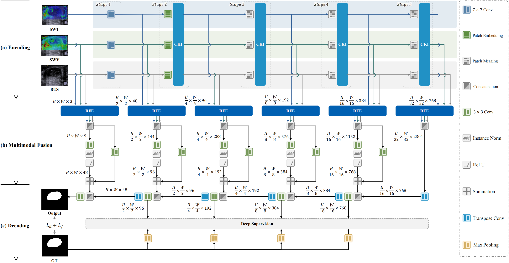
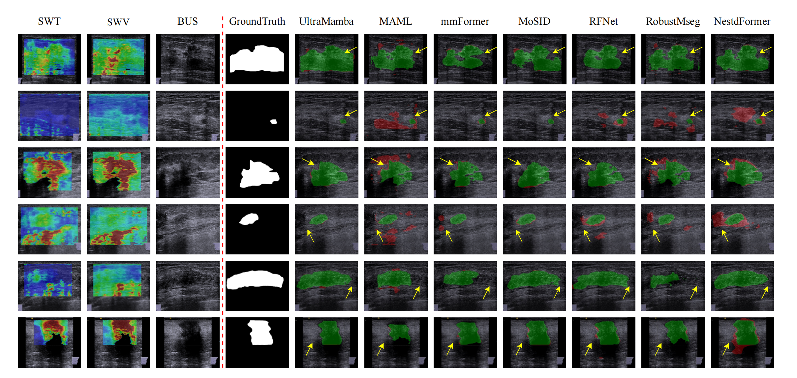

# UltraMamba: Mamba-based Multimodal Ultrasound Image Adaptive Fusion for Breast Lesion Segmentation

More details of this project will be released soon.

# Network Architecture

# Data Description
Dataset Name: MUB2024

Modality: SWT, SWV, BUS

Challenge: Breast Lesion Segmentation Challenge

The dataset will be publicly released within one week of paper acceptance.

The MUB2025 dataset was meticulously assembled from diagnostic imaging performed on 506 breast cancer patients
undergoing neoadjuvant therapy at Sun Yat-sen University Cancer Center and Sun Yat-sen Memorial Hospital between
October 2016 and May 2023. This robust dataset employs a Siemens Acuson S2000 ultrasound diagnostic instrument
equipped with a 9L4 linear array probe, operating within a frequency range of 4.0MHz to 9.0MHz, to ensure high-
resolution image capture.

# Benchmark
Performance comparative analysis of different network architectures for breast lesion segmentation on the MUB2025 dataset.

# Visualization
Error map visualizations of the UltraMamba and baseline methods in the MUB2025 datasets. The correct segmentation
position and the incorrect or missing portion of the detection are in green and red, respectively.
