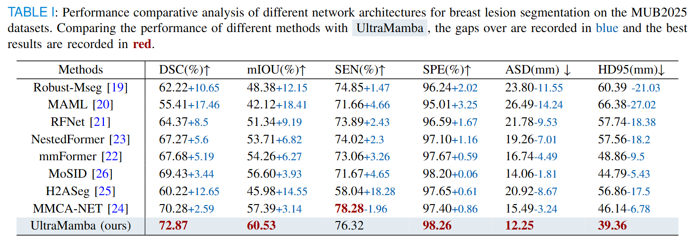

# UltraMamba: Mamba-based Multimodal Ultrasound Image Adaptive Fusion for Breast Lesion Segmentation

More details of this project will be released soon.

# Network Architecture

# Data Description
Dataset Name: MUB2024

Modality: SWT, SWV, BUS

Challenge: Breast Lesion Segmentation Challenge

The dataset will be publicly released within one week of paper acceptance.

# Benchmark
Performance comparative analysis of different network architectures for breast lesion segmentation in the MUB2025 dataset.

# Visualization

